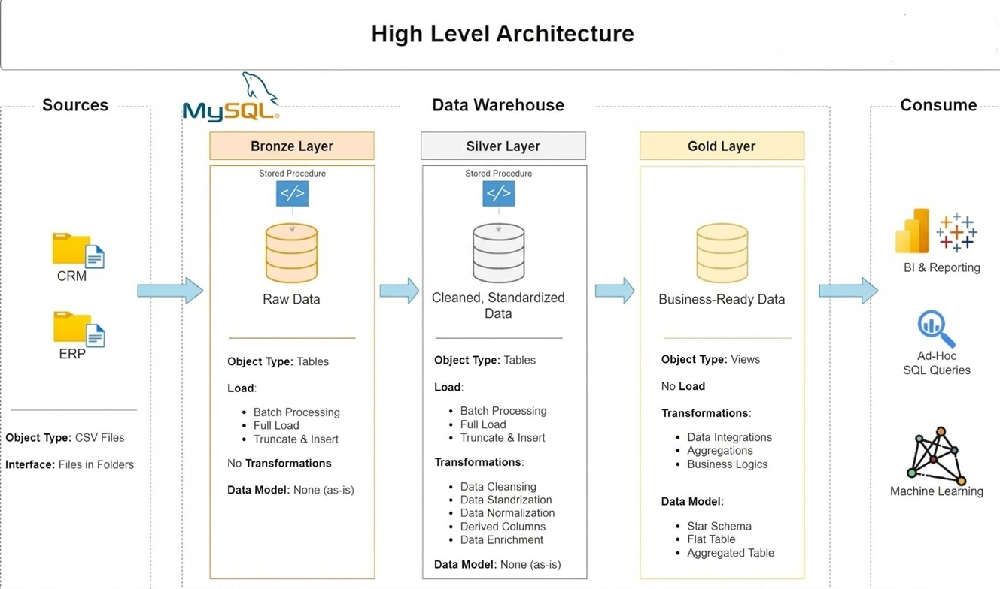

# 📊 Sales Analytics Data Warehouse Project

## 🚀 Overview

This project demonstrates an **end-to-end data analytics pipeline** built using SQL, covering:

* Data ingestion from multiple sources (CRM & ERP)
* Data warehousing using Bronze, Silver, and Gold layers
* Exploratory Data Analysis (EDA)
* Advanced SQL analytics (CTEs, window functions)
* Business-ready reporting

---

## 🏗️ Data Architecture

The project follows a **modern data warehouse architecture**:

* **Bronze Layer** → Raw data ingestion from source systems
* **Silver Layer** → Data cleaning, transformation, and standardization
* **Gold Layer** → Business-ready dimensional model

  

---

## 🔄 Data Sources

### CRM System

* `cust_info.csv` → Customer details
* `prd_info.csv` → Product information
* `sales_details.csv` → Sales transactions

### ERP System

* `cust_az12.csv` → Customer data
* `loc_a101.csv` → Location data
* `px_cat_g1v2.csv` → Product category data

---

## 📂 Project Structure

```bash
sales-analytics-data-warehouse
│
├── data/
│   ├── source_crm/
│   ├── source_erp/
│   └── raw/
│
├── scripts/
│   ├── ingestion/
│   │   └── bronze/
│   │
│   ├── transformation/
│   │   ├── silver/
│   │   └── gold/
│   │
│   ├── analytics/
│   │   ├── eda/
│   │   └── reports/
│   │
│   ├── testing/
│   └── setup/
│
├── docs/
│   ├── architecture/
│   ├── flow/
│   ├── modeling/
│   └── catalog/
│
└── README.md
```

---

## ⚙️ Data Pipeline

### 1️⃣ Bronze Layer (Ingestion)

* Load raw CSV data from CRM & ERP
* Minimal transformation
* Preserve original structure

### 2️⃣ Silver Layer (Transformation)

* Data cleaning and validation
* Standardizing schemas across systems
* Handling nulls and inconsistencies
* Merging CRM and ERP datasets

### 3️⃣ Gold Layer (Modeling)

* Dimensional modeling (Star Schema):

  * `dim_customers`
  * `dim_products`
  * `fact_sales`
* Optimized for analytics and reporting

---

## 📊 Analytics & Reporting

### 🔍 Exploratory Data Analysis (EDA)

* Customer segmentation
* Revenue trends over time
* Product performance analysis
* Ranking and window function analysis

### 📈 Reports

* **Customer Report** → Insights on customer behavior
* **Product Performance Report** → Revenue and sales trends

---


## 🧠 Key Skills Demonstrated

* SQL (Advanced):

  * CTEs
  * Window Functions
  * Aggregations
* Data Warehousing Concepts
* Data Modeling (Star Schema)
* Data Cleaning & Transformation
* Analytical Thinking
* End-to-End Pipeline Design

---

## 📌 How to Run

1. Initialize database:

```sql
-- scripts/setup/init_database.sql
```

2. Load Bronze Layer:

```sql
-- scripts/ingestion/bronze/
```

3. Transform to Silver:

```sql
-- scripts/transformation/silver/
```

4. Build Gold Layer:

```sql
-- scripts/transformation/gold/
```

5. Run analytics & reports:

```sql
-- scripts/analytics/
```

---

## 📷 Documentation

* Architecture Diagram → `docs/architecture/`
* Data Flow → `docs/flow/`
* Data Model → `docs/modeling/`
* Data Catalog → `docs/catalog/`

---

## 🎯 Project Highlights

* Integrated multiple data sources (CRM & ERP)
* Designed a scalable data warehouse architecture
* Built business-ready analytical reports
* Implemented data quality validation

---

## 📬 Conclusion

This project simulates a **real-world data analytics workflow**, transforming raw data into meaningful business insights using structured data engineering and SQL techniques.

---
